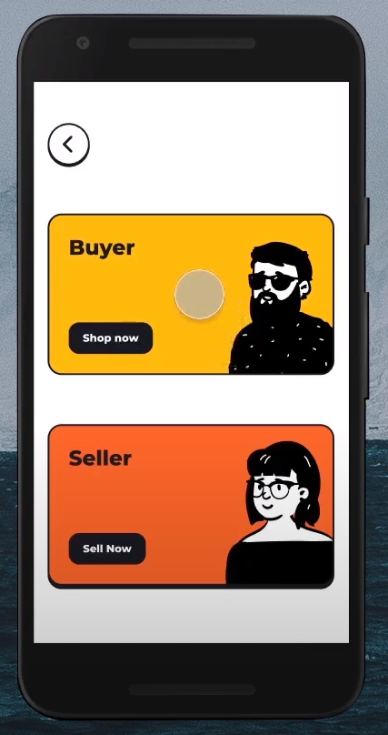
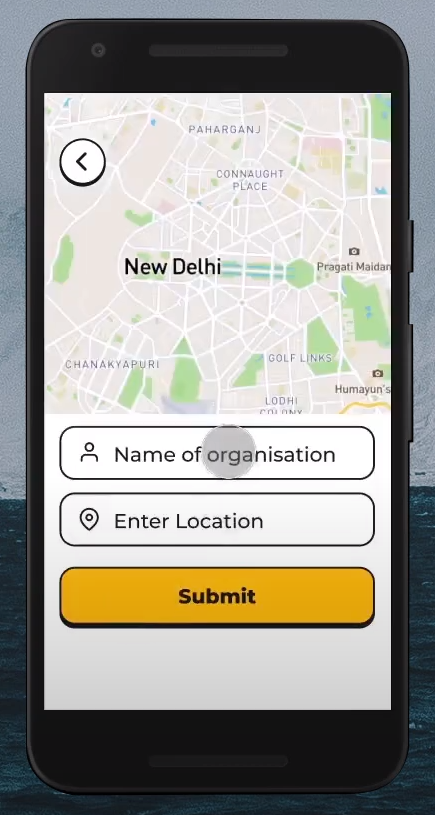

# VenXdoor by COVIDBugs 

During the pandemic, everyone’s biggest concern is staying inside and staying safe. In these difficult times, local vendors and producers are the only sources to get our essentials from. But we don’t always know all the vendors near our location or what kind of products they sell. This app will bring together all the local vendors and producers on one platform where they can host their businesses along with the availability of the products they sell. The buyer can search for sellers up until a certain area from his current location and then choose the products he needs to buy from different sellers. The order, once placed, will either be delivered to the buyer’s home or picked up from the vendors’ location. 

Our app makes it extremely easy for shoppers to get what they need in a short amount of time. Thanks to the app’s location sorting, shoppers are able to search for and buy from vendors close in location to them.

As long as people are willing to shop online for their essentials, this app will stay relevant and necessary. The pandemic has caused many to start ordering online, but online shopping has been popular for many years and will continue to be, if not more. 

This app was coded entirely in Java, using JavaFX for frontend. 

To run what we have made: \\
```UIDesign\out\artifacts\launch.vbs```

Video demonstration of app: https://youtu.be/HOWKhSJVi8k


<p align="center">

</p>

<p align="left">

</p>

<p align="right">

</p>

